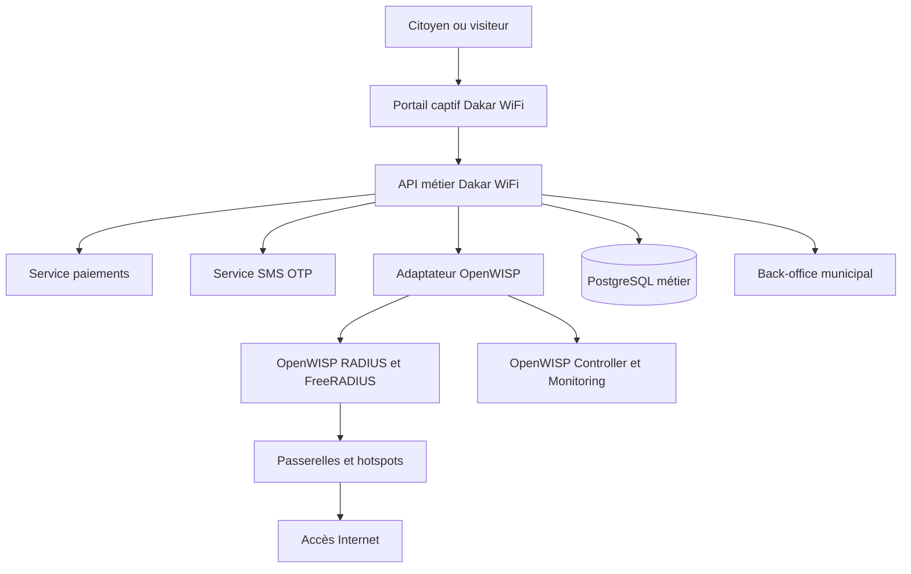
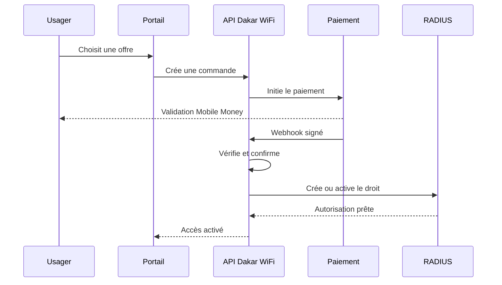

# Cahier des charges technique — Plateforme « Dakar WiFi »

> Document de référence destiné à Claude Code et à l'équipe de développement  
> Version : 1.2  
> Date : 16 août 2026  
> Commanditaire pressenti : Ville de Dakar  
> Statut : cadrage initial pour conception et développement d'un pilote

---

## 1. Instructions impératives pour Claude Code

Claude Code doit lire l'intégralité de ce document avant de créer ou modifier du code.

1. Ne pas développer un remplacement d'OpenWISP. OpenWISP constitue le moteur de gestion réseau, de supervision et d'AAA/RADIUS. La plateforme Dakar WiFi se construit autour de ses API.
2. Ne pas forker ni modifier le cœur d'OpenWISP, sauf décision documentée et validée. Utiliser des adaptateurs et services séparés afin de faciliter les mises à jour futures.
3. Livrer le projet progressivement, selon les phases décrites dans ce document. Ne pas tenter de produire toute la plateforme en une seule itération.
4. Avant chaque phase : analyser l'existant, présenter les fichiers concernés, proposer un plan court, puis implémenter.
5. Ne jamais inventer une clé API, un identifiant OpenWISP, un secret RADIUS, un numéro marchand ou une URL de production.
6. Tous les secrets doivent être fournis par variables d'environnement. Fournir uniquement des valeurs fictives dans `.env.example`.
7. Les intégrations de paiement doivent commencer par un adaptateur `mock`, entièrement testable localement. Les connecteurs Wave, Orange Money, Free Money et carte bancaire sont des adaptateurs indépendants et activables par configuration.
8. Les montants doivent être stockés sous forme d'entiers en francs CFA (`XOF`), jamais en nombres décimaux.
9. Toute réception de webhook doit être authentifiée, idempotente, historisée et résistante aux répétitions et aux arrivées dans le désordre.
10. Ne jamais considérer un paiement comme réussi sur la seule base d'une redirection du navigateur. Seul un webhook vérifié ou une vérification serveur-à-serveur peut confirmer le paiement.
11. Ne pas stocker les données de carte bancaire. Utiliser les pages ou jetons sécurisés du prestataire de paiement.
12. Toutes les actions administratives sensibles doivent être consignées dans un journal d'audit non modifiable depuis l'interface courante.
13. Chaque phase doit comporter : migrations, tests unitaires, tests d'intégration, documentation, données de démonstration et critères d'acceptation vérifiables.
14. Aucun écran ne doit être marqué « terminé » s'il ne communique qu'avec des données statiques. Les mocks doivent être explicitement signalés comme tels.
15. Le portail captif doit être conçu d'abord pour les téléphones Android d'entrée de gamme, les réseaux lents et les mini-navigateurs captifs.
16. La langue principale est le français. L'architecture d'internationalisation doit prévoir le wolof et l'anglais dès le départ. La disponibilité réelle de contenus écrits en wolof n'étant pas garantie, prévoir des parcours compréhensibles sans texte long : pictogrammes, icônes explicites et, si validé, messages audio.
17. Respecter les règles de protection des données applicables au Sénégal. Les durées de conservation doivent être configurables et validées avant la production.
18. Ne jamais exécuter une opération destructive sur une base de production. Les commandes de réinitialisation doivent refuser de fonctionner lorsque `ENVIRONMENT=production`.

---

## 2. Vision du projet

La plateforme Dakar WiFi doit permettre à la Ville de Dakar de proposer un accès Wi-Fi public unifié sur plusieurs sites : mairies, places publiques, jardins, marchés, bibliothèques, espaces culturels, zones touristiques, sites événementiels et zones commerciales.

Selon la politique définie pour chaque zone, l'accès pourra être :

- entièrement gratuit ;
- gratuit avec une limite de temps, de volume ou de débit ;
- sponsorisé par une institution ou une entreprise ;
- payant à l'heure, à la journée, à la semaine ou au mois ;
- hybride, avec une allocation gratuite suivie d'une proposition de forfait payant.

Un même compte citoyen doit fonctionner sur l'ensemble des hotspots participants. L'utilisateur ne doit pas avoir à créer un nouveau compte à chaque changement de site.

### 2.1 Objectifs principaux

- Favoriser l'inclusion numérique et l'accès aux services publics.
- Mutualiser la gestion des hotspots de la Ville.
- Assurer une expérience simple sur mobile.
- Autoriser des modèles gratuits, sponsorisés et payants.
- Contrôler les quotas, débits, horaires et sessions par RADIUS.
- Superviser les équipements, la connectivité et la qualité de service.
- Produire des données d'exploitation et financières fiables.
- Permettre l'intégration progressive de plusieurs opérateurs Internet, moyens de paiement et fabricants d'équipements.
- Garantir la souveraineté de la Ville sur les données et les règles de service.

### 2.2 Nom de travail et identité

- Nom de travail : **Dakar WiFi**.
- SSID recommandé pour le pilote : `DAKAR-WIFI`.
- Le portail et le back-office doivent être personnalisables sans modification de code : logo, couleurs, textes, conditions d'utilisation, contacts et visuels.
- Aucun logo définitif ne doit être inventé par Claude Code. Utiliser un placeholder neutre jusqu'à fourniture des éléments officiels.

---

## 3. Périmètre du pilote

Le produit doit être conçu pour évoluer, mais le premier déploiement doit rester réaliste et maîtrisable.

### 3.1 Hypothèses de dimensionnement initial

| Élément | Pilote | Cible extensible |
|---|---:|---:|
| Sites | 10 à 20 | 100 et plus |
| Points d'accès | 20 à 50 | 500 et plus |
| Comptes enregistrés | 10 000 | 500 000 |
| Utilisateurs simultanés | 2 000 | 20 000 |
| Transactions par jour | 2 000 | 50 000 |
| Opérateurs administratifs | 20 | 200 |

Ces valeurs sont des hypothèses de conception, non des engagements de capacité. Des tests de charge devront confirmer le dimensionnement.

### 3.2 Inclus dans le MVP

- Portail captif web responsive/PWA.
- Inscription et connexion par numéro de téléphone et OTP.
- Acceptation versionnée des conditions d'utilisation.
- Détection de la zone et affichage des offres disponibles.
- Offre gratuite avec quotas et limitations.
- Offres payantes configurables.
- Paiement simulé complet en environnement local et de recette.
- Architecture prête pour Wave, Orange Money, Free Money et agrégateur de carte bancaire.
- Coupons/vouchers à usage unique ou multiple.
- Création et activation d'un droit d'accès RADIUS.
- Suivi des sessions et de la consommation.
- Back-office municipal.
- Cartographie des sites et hotspots.
- Gestion des plans, zones, équipements et sponsors.
- Tableaux de bord techniques et commerciaux.
- Rapprochement élémentaire des paiements.
- Alertes, incidents et journal d'audit.
- API documentée.

> **Note de cadrage.** Ce périmètre correspond au MVP complet livré à l'issue des phases 1 à 6. Le **noyau minimal démontrable sur le terrain** est plus restreint : inscription OTP, accès gratuit avec quota réel et un forfait payant avec prestataire mock. Les critères d'acceptation sont évalués **par phase** (voir §17 et §18), et non d'un seul bloc en fin de projet.

### 3.3 Hors MVP mais à anticiper

- Application mobile native iOS/Android.
- Publicité programmatique.
- Fidélité avancée et cashback.
- Marketplace de services municipaux.
- Facturation B2B complexe.
- Wi-Fi roaming national ou Passpoint/OpenRoaming.
- Intelligence artificielle prédictive.
- Corrélation avec la vidéosurveillance.
- Vente de données personnelles ou profilage publicitaire individualisé, qui sont explicitement interdits sans base juridique et validation formelle.

---

## 4. Principes d'architecture

### 4.1 Architecture logique



### 4.2 Répartition des responsabilités

| Composant | Responsabilités |
|---|---|
| OpenWISP Controller | Provisionnement, configuration, VPN, inventaire réseau, topologie, firmware |
| OpenWISP Monitoring | Disponibilité, latence, ressources, trafic, clients, alertes réseau |
| OpenWISP RADIUS/FreeRADIUS | Authentification, autorisation, accounting, quotas, sessions simultanées, CoA |
| Portail Dakar WiFi | Inscription, connexion, choix de forfait, paiement, statut de consommation |
| API métier Dakar WiFi | Catalogue, zones, commandes, paiements, abonnements, vouchers, règles métier |
| Back-office | Administration fonctionnelle, exploitation, finances, rapports et audit |
| Adaptateurs | Isolation des API OpenWISP, SMS, paiement, cartographie et notifications |

### 4.3 Décisions structurantes

- OpenWISP est un système externe de référence pour le réseau et RADIUS.
- La base métier Dakar WiFi ne doit pas écrire directement dans les tables internes d'OpenWISP.
- Les échanges passent par les API officielles et un adaptateur versionné.
- Les événements RADIUS accounting doivent être importés ou synchronisés sans double comptage.
- L'accès doit pouvoir être activé immédiatement après un paiement réussi, idéalement via CoA lorsque l'équipement le permet.
- L'indisponibilité temporaire d'un prestataire de paiement ne doit pas compromettre l'intégrité des commandes.
- La continuité d'exploitation locale en cas de panne du système central (période de grâce pour les autorisations déjà valides) est un **point d'étude**, pas une exigence ferme : elle dépend fortement des capacités des passerelles retenues. Le résultat de l'étude (faisable/non faisable par modèle de matériel, durée de grâce possible) doit être documenté dans un ADR avant la Phase 5.

---

## 5. Stack technique recommandée

Claude Code peut proposer un ajustement uniquement s'il est argumenté et documenté dans un ADR.

### 5.1 Monorepo

```text
dakar-wifi/
├── apps/
│   ├── captive-portal/       # Next.js, PWA mobile-first
│   └── admin-dashboard/      # Next.js, back-office
├── services/
│   └── core-api/             # Django + Django REST Framework
├── packages/
│   ├── ui/                   # composants partagés
│   ├── api-client/           # client TypeScript généré depuis OpenAPI
│   └── config/               # configurations lint/test partagées
├── infra/
│   ├── compose/              # développement uniquement
│   ├── ansible/              # déploiement applicatif et documentation OpenWISP
│   ├── nginx/
│   └── monitoring/
├── docs/
│   ├── adr/
│   ├── api/
│   ├── exploitation/
│   └── securite/
├── scripts/
├── .env.example
├── Makefile
└── README.md
```

### 5.2 Technologies

| Domaine | Choix recommandé |
|---|---|
| Portail captif | Astro en sortie statique, TypeScript, mobile-first — aucun runtime de framework expédié au navigateur (voir ADR-0005) |
| Back-office | Next.js avec TypeScript et React |
| UI | Tailwind CSS et bibliothèque de composants accessible |
| Backend métier | Django, Django REST Framework |
| Tâches asynchrones | Celery |
| Base relationnelle | PostgreSQL |
| Cache et files | Redis |
| Contrats API | OpenAPI 3.1 |
| Authentification admin | OIDC/OAuth2 si disponible, sinon Django sécurisé avec MFA |
| Authentification citoyen | Téléphone + OTP + jetons courts et renouvellement contrôlé |
| Cartographie | OpenStreetMap avec bibliothèque compatible |
| Observabilité | Prometheus, Grafana, Loki ou équivalent validé |
| Tests front | Vitest et Playwright |
| Tests backend | Pytest |
| Qualité | Ruff, mypy, ESLint, Prettier |

### 5.3 Environnements

- `local` : développement, services mock, données fictives.
- `test` : tests automatisés isolés.
- `staging` : recette avec sandbox paiement/SMS et OpenWISP de test.
- `production` : secrets externes, données réelles, supervision et sauvegardes.

Le projet doit pouvoir démarrer localement avec une commande documentée, sans exiger un véritable compte marchand ni un OpenWISP de production.

---

## 6. Compatibilité réseau et équipements

### 6.1 Modèle privilégié

Pour profiter de toutes les capacités OpenWISP, privilégier des routeurs ou passerelles compatibles OpenWrt. Le choix du matériel doit être validé modèle par modèle : chipset, mémoire, flash, radios, PoE, température, disponibilité du firmware et maturité du support OpenWrt.

### 6.2 Environnement UniFi/Ubiquiti

La plateforme doit également accepter une architecture hybride :

- points d'accès UniFi gérés par le contrôleur UniFi ;
- authentification et accounting via RADIUS lorsque les fonctions nécessaires sont supportées ;
- passerelle captive compatible ;
- intégration de supervision par API, SNMP ou adaptateur dédié ;
- aucune promesse de gestion OpenWISP complète d'un équipement propriétaire sans preuve de compatibilité.

Créer une interface `NetworkProvider` afin de ne pas coupler le métier à un seul constructeur :

```text
NetworkProvider
├── OpenWispProvider
├── MockNetworkProvider
└── UnifiProvider        # phase ultérieure, derrière un feature flag
```

### 6.3 Résilience des sites

- Chaque hotspot doit être rattaché à un site, une zone, une passerelle et un fournisseur Internet.
- Supporter plusieurs liens WAN et documenter le mécanisme de bascule lorsqu'il existe.
- Prévoir un cache local ou une période de grâce pour les autorisations déjà valides, si le matériel le permet.
- Les communications RADIUS à travers Internet doivent passer par un réseau de gestion sécurisé VPN.

---

## 7. Rôles et habilitations

Appliquer le principe du moindre privilège. Les rôles doivent être configurables, mais le MVP comprend au minimum :

| Rôle | Droits principaux |
|---|---|
| Superadministrateur | Configuration globale, organisations, intégrations, rôles |
| Administrateur Ville | Zones, plans, utilisateurs internes, rapports globaux |
| Exploitant réseau | Sites, équipements, disponibilité, incidents, diagnostics |
| Responsable commercial | Offres, vouchers, sponsors, campagnes |
| Responsable financier | Transactions, rapprochements, remboursements, exports |
| Agent support | Recherche utilisateur, session, diagnostic et assistance limitée |
| Auditeur | Consultation en lecture seule des journaux, opérations et rapports |
| Partenaire/Sponsor | Consultation limitée aux zones et campagnes qui lui sont affectées |
| Citoyen/Visiteur | Compte, forfaits, paiements, sessions et assistance personnelle |

Exigences :

- Un agent support ne peut pas voir les secrets, modifier les tarifs ou rembourser.
- Un responsable financier ne peut pas modifier la configuration réseau.
- Les exports de données personnelles sont autorisés uniquement aux rôles explicitement habilités.
- Toute élévation de privilège, désactivation d'un compte ou modification de tarif doit être auditée.
- Les comptes administratifs doivent supporter le MFA.

---

## 8. Fonctionnalités détaillées

### 8.1 Gestion des comptes citoyens

- Inscription par numéro de téléphone au format international normalisé.
- Envoi d'un OTP à durée limitée.
- Limitation du nombre de demandes par numéro, adresse IP, appareil et période.
- Blocage progressif en cas d'abus.
- Possibilité de compléter facultativement : prénom, nom, email et langue.
- Acceptation explicite des conditions d'utilisation et de la politique de confidentialité, avec version et horodatage.
- Reconnexion simplifiée sur un appareil connu, sans contourner les règles de sécurité.
- **Randomisation des adresses MAC** : Android et iOS utilisent par défaut une adresse MAC aléatoire par réseau, et les versions récentes d'iOS peuvent la faire tourner périodiquement. La reconnaissance d'appareil doit donc être conçue comme **au mieux stable par SSID, jamais garantie**. Aucune fonctionnalité critique (sécurité, quota, facturation) ne doit reposer uniquement sur la MAC ; elle sert d'indice de confort, le compte et le jeton restant la source d'autorité. Le comportement en cas de rotation de MAC (nouvel appareil détecté) doit être défini et testé.
- Consultation et suppression du compte selon la politique validée.
- Export des données personnelles sur demande autorisée.
- Interdiction de rendre le compte dépendant d'un login social.

### 8.2 Détection du hotspot et de la zone

Le portail reçoit un contexte signé ou vérifiable fourni par le hotspot : identifiant NAS, adresse MAC du client lorsque disponible, adresse IP, SSID, URL de retour et identifiant de zone.

- Ne jamais faire confiance à un `zone_id`, un prix ou une offre envoyé directement par le navigateur.
- Résoudre la zone côté serveur à partir d'un identifiant réseau autorisé.
- Refuser les paramètres de redirection vers un domaine non autorisé.
- Afficher les offres et messages propres à la zone.
- Gérer un mode de repli lorsque le hotspot est connu mais mal configuré.

### 8.3 Catalogue et politiques d'accès

Une offre contient au minimum :

- nom public et description ;
- type : `free`, `paid`, `sponsored`, `hybrid` ;
- montant en XOF ;
- durée calendaire et/ou durée de connexion ;
- quota montant et descendant ;
- débit maximal descendant et montant ;
- nombre de sessions simultanées ;
- période de validité après achat ;
- plages horaires autorisées ;
- zones éligibles ;
- période de vente ;
- priorité et visibilité ;
- profil RADIUS associé ;
- règles de renouvellement ;
- politique de remboursement ;
- statut brouillon, publié, suspendu ou archivé.

La modification d'une offre publiée ne doit pas changer rétroactivement les droits déjà achetés. Créer une version immuable du plan au moment de la commande.

### 8.4 Accès gratuit

Le système doit permettre de définir, par zone :

- quota quotidien, hebdomadaire ou mensuel ;
- durée maximale par session et par période ;
- délai avant nouvelle attribution gratuite ;
- débit maximal ;
- nombre d'appareils autorisés ;
- ouverture seulement pendant certaines heures ;
- accès sponsorisé avec code ou campagne ;
- walled garden vers les services municipaux lorsque le quota général est épuisé.

Le contrôle du droit gratuit doit être réalisé côté serveur et dans RADIUS, pas seulement dans l'interface.

### 8.5 Achat et paiement

### Parcours nominal



### Exigences

- Numéro de commande interne unique.
- Référence externe du prestataire.
- États : `draft`, `pending`, `requires_action`, `paid`, `failed`, `expired`, `cancelled`, `refunded`, `partially_refunded`.
- Clé d'idempotence pour chaque tentative.
- **Délai d'expiration configurable** des commandes `pending` (valeur par défaut proposée : 30 minutes, à valider par prestataire). Une tâche planifiée passe les commandes échues à `expired`.
- **Webhook reçu après expiration** : cas explicitement géré. Si le paiement est confirmé alors que la commande est `expired`, la commande est réactivée et le droit activé (le client a payé) ; l'événement est journalisé et remonté au rapprochement. Ce scénario fait partie des tests obligatoires (§16.1).
- Historique de tous les webhooks, y compris les doublons et échecs de validation.
- Vérification de signature et de montant.
- Comparaison stricte de la devise et du bénéficiaire.
- Tâche de réconciliation pour les paiements restés `pending`.
- Activation du forfait une seule fois.
- Reprise automatique si le paiement est confirmé mais que RADIUS est temporairement indisponible.
- Reçu téléchargeable et notification de confirmation.
- Remboursement soumis à habilitation et audit.

### Contrainte du mini-navigateur captif

Les parcours de paiement par redirection (deep link vers l'application Wave/Orange Money, ouverture d'un nouvel onglet) sont **incompatibles avec le mini-navigateur captif** : celui-ci ne peut pas ouvrir d'application tierce et sa fermeture interrompt le parcours.

En conséquence :

- Le **parcours nominal** est le **paiement par push initié côté serveur** : l'API déclenche une demande de validation directement sur le téléphone du client (push Wave, USSD/push Orange Money), sans redirection. Le portail affiche un écran d'attente avec sondage du statut.
- La redirection vers une page de paiement hébergée est le **parcours de repli**, réservé aux cas où le push n'est pas disponible, avec incitation à ouvrir le portail dans le navigateur complet.
- L'interface `PaymentProvider` et le `MockPaymentProvider` doivent modéliser les deux parcours dès la Phase 4.
- La capacité push réelle de chaque prestataire doit être vérifiée sur documentation et sandbox avant tout engagement (Phase 7).

### Interface d'adaptateur

```text
PaymentProvider
├── create_payment(order)
├── get_payment_status(external_reference)
├── verify_webhook(headers, body)
├── parse_webhook(body)
├── refund(payment, amount)
└── healthcheck()
```

Implémentations prévues : `MockPaymentProvider`, `WavePaymentProvider`, `OrangeMoneyPaymentProvider`, `FreeMoneyPaymentProvider`, `CardAggregatorProvider`.

### 8.6 Vouchers et accès sponsorisé

- Génération unitaire ou en lot.
- Codes non prédictibles et stockés sous forme hachée lorsque possible.
- Validité temporelle.
- Nombre maximal d'utilisations.
- Restriction à une zone, une offre, un partenaire ou une campagne.
- Import/export contrôlé.
- Révocation et audit.
- Tableau d'utilisation : distribués, activés, expirés, révoqués.
- Aucun code complet ne doit apparaître dans les logs.

### 8.7 Abonnements et droits RADIUS

- Création d'un entitlement métier après attribution gratuite, paiement ou voucher.
- Synchronisation avec OpenWISP RADIUS par tâche idempotente.
- États : `pending_activation`, `active`, `exhausted`, `expired`, `suspended`, `revoked`, `activation_failed`.
- Conservation du lien entre utilisateur, appareil, plan versionné, zone et identifiant RADIUS.
- Gestion des limites de temps, de trafic et de sessions simultanées.
- Possibilité de couper ou modifier une session via CoA lorsque supporté.
- Réconciliation périodique entre les droits métier et RADIUS.
- File de reprise et interface opérateur pour les activations en échec.

### 8.8 Sessions et consommation

- Importer les événements start, interim-update et stop de RADIUS accounting.
- Dédupliquer par identifiant de session et NAS.
- Afficher : début, dernière activité, fin, durée, upload, download, appareil, hotspot et offre.
- Gérer les sessions sans événement stop par une règle d'expiration.
- Ne pas exposer l'adresse MAC complète dans les exports ordinaires ; utiliser un masquage ou pseudonyme.
- Permettre à l'usager de fermer une session lorsqu'elle est active.
- Permettre à un agent autorisé de forcer une déconnexion avec justification.

### 8.9 Sites, zones et hotspots

- Hiérarchie : organisation > commune/secteur > site > zone > hotspot/passerelle.
- Coordonnées GPS, adresse, horaires, statut public, photos facultatives.
- Fournisseur Internet, référence de circuit, débit souscrit et contact d'escalade.
- Inventaire : fabricant, modèle, numéro de série, MAC, firmware et date d'installation.
- État : planifié, en installation, actif, dégradé, hors service, maintenance, retiré.
- Carte avec filtres et clustering.
- Fiche de santé d'un site : disponibilité, clients, débit, incidents, dernière communication.
- Les identifiants et secrets RADIUS ne doivent jamais être affichés en clair dans les listes.

### 8.10 Supervision et incidents

- Agréger ou lier les métriques OpenWISP sans dupliquer inutilement son moteur de supervision.
- Alertes : équipement hors ligne, perte de paquets, saturation, CPU/mémoire, VPN rompu, accounting absent, forte hausse d'échecs de connexion, paiement indisponible.
- Seuils configurables par type de site.
- Création manuelle ou automatique d'un incident.
- Cycle : ouvert, pris en charge, en attente, résolu, clos.
- Priorités P1 à P4.
- Affectation, commentaires, pièces jointes et chronologie.
- Calcul du temps de prise en charge et de résolution.
- Ne pas prétendre remplacer un outil ITSM complet dans le MVP.

### 8.11 Sponsors et campagnes

- Sponsor, contrat, période, budget informatif et zones concernées.
- Campagne pouvant financer un quota gratuit ou un ensemble de vouchers.
- Personnalisation limitée et validée du portail par zone.
- Comptabilisation des activations et consommations sponsorisées.
- Vue partenaire strictement limitée à ses propres campagnes.
- Aucun accès partenaire aux identités détaillées des usagers sans fondement juridique explicite.

### 8.12 Support usager

- Formulaire simple depuis le portail.
- Catégories : connexion, OTP, paiement, quota, qualité, autre.
- Numéro de ticket.
- Association facultative à l'utilisateur, la commande, la session et le hotspot.
- Diagnostic guidé pour l'agent support.
- Masquage des données sensibles.
- Journal des consultations sensibles par les agents.

### 8.13 Rapports et tableaux de bord

### Technique

- Disponibilité par site et période.
- Hotspots hors ligne ou dégradés.
- Utilisateurs simultanés.
- Consommation et saturation.
- Incidents et SLA.

### Usage

- Comptes actifs.
- Nouveaux utilisateurs.
- Sessions et durée moyenne.
- Consommation par zone et type d'offre.
- Taux de retour, sous forme agrégée.

### Finance

- Commandes et paiements par statut.
- Chiffre d'affaires brut en XOF.
- Frais prestataire lorsqu'ils sont disponibles.
- Montants remboursés.
- Écart de rapprochement.
- Ventilation par zone, offre et moyen de paiement.

Les agrégats doivent être recalculables à partir des données sources. Les fuseaux horaires doivent être explicites et l'affichage métier utiliser `Africa/Dakar`.

---

## 9. Modèle de données métier minimal

Les noms peuvent évoluer, mais les concepts doivent être conservés.

| Entité | Champs essentiels |
|---|---|
| `User` | id, phone_e164, email, preferred_language, status, verified_at |
| `UserDevice` | id, user_id, mac_hash, first_seen_at, last_seen_at, trusted_until |
| `TermsVersion` | id, type, version, content_url, published_at |
| `Consent` | user_id, terms_version_id, accepted_at, source |
| `Organization` | id, name, type, status |
| `Site` | id, organization_id, name, address, latitude, longitude, status |
| `Zone` | id, site_id, code, access_mode, timezone, status |
| `Hotspot` | id, zone_id, nas_identifier, provider, external_id, status |
| `Plan` | id, code, current_version, type, status |
| `PlanVersion` | id, plan_id, price_xof, limits_json, radius_profile_ref, effective_at |
| `Order` | id, user_id, plan_version_id, amount_xof, status, idempotency_key |
| `Payment` | id, order_id, provider, external_reference, amount_xof, fees_xof, status |
| `Refund` | id, payment_id, amount_xof, reason, requested_by, status, external_reference, processed_at |
| `WebhookEvent` | id, provider, external_event_id, signature_valid, payload_encrypted, processed_at |
| `Entitlement` | id, user_id, plan_version_id, zone_scope, status, starts_at, ends_at |
| `RadiusBinding` | entitlement_id, radius_user_ref, sync_status, last_synced_at |
| `NetworkSession` | id, radius_session_id, user_id, hotspot_id, start_at, stop_at, bytes_in, bytes_out |
| `VoucherBatch` | id, plan_version_id, quantity, sponsor_id, expires_at |
| `Voucher` | id, batch_id, code_hash, max_uses, uses_count, status |
| `Sponsor` | id, name, status, contact_data |
| `Campaign` | id, sponsor_id, start_at, end_at, zone_scope, status |
| `Incident` | id, hotspot_id, priority, status, assigned_to, opened_at, resolved_at |
| `AuditLog` | actor_id, action, target_type, target_id, before_json, after_json, occurred_at |
| `ReconciliationRun` | provider, period_start, period_end, status, totals_json |
| `OtpRequest` | id, phone_e164, ip_hash, device_hint, status, attempts_count, sent_at, verified_at, expired_at |
| `SmsMessage` | id, provider, recipient_e164, purpose, status, provider_reference, cost_xof, sent_at, delivered_at |
| `SupportTicket` | id, ticket_number, user_id, category, status, order_id, session_id, hotspot_id, opened_at, resolved_at |
| `WalledGardenEntry` | id, zone_id, domain_or_cidr, purpose, enabled, valid_from, valid_until |

### Contraintes essentielles

- UUID pour les identifiants publics.
- Index sur numéros normalisés, références externes, statuts et dates.
- Contraintes d'unicité sur les identifiants de webhook et de session.
- Suppression logique lorsque la traçabilité financière ou d'audit l'impose.
- Horodatages stockés en UTC et affichés en `Africa/Dakar`.
- Chiffrement applicatif des payloads sensibles si leur conservation est nécessaire.
- Ne pas stocker une copie complète d'un webhook contenant des secrets si une version minimisée suffit.

---

## 10. API métier

Toutes les API doivent être versionnées sous `/api/v1`, documentées avec OpenAPI et protégées selon leur usage.

### 10.1 API publique du portail

```text
POST   /api/v1/auth/otp/request
POST   /api/v1/auth/otp/verify
POST   /api/v1/auth/refresh
POST   /api/v1/auth/logout
GET    /api/v1/portal/context
GET    /api/v1/portal/plans
POST   /api/v1/orders
GET    /api/v1/orders/{id}
POST   /api/v1/orders/{id}/payments
GET    /api/v1/payments/{id}/status
POST   /api/v1/vouchers/redeem
GET    /api/v1/me
GET    /api/v1/me/entitlements
GET    /api/v1/me/sessions
POST   /api/v1/me/sessions/{id}/disconnect
GET    /api/v1/public/hotspots
POST   /api/v1/support/tickets
```

### 10.2 Webhooks

```text
POST   /api/v1/webhooks/payments/{provider}
POST   /api/v1/webhooks/network/radius-accounting   # uniquement si retenu par l'architecture
```

### 10.3 API d'administration

Prévoir les ressources CRUD et actions contrôlées pour : organisations, sites, zones, hotspots, plans, sponsors, campagnes, vouchers, utilisateurs internes, commandes, paiements, rapprochements, incidents et rapports.

### 10.4 Conventions

- Réponses d'erreur structurées avec code stable, message localisable et identifiant de corrélation.
- Pagination par curseur pour les grands volumes.
- Filtres et tris explicitement autorisés.
- Protection contre le mass assignment.
- Idempotency-Key pour les créations financières.
- `X-Request-ID` propagé entre services.
- Pas d'information interne ou trace d'exception renvoyée au client.

---

## 11. Adaptateur OpenWISP

Créer une couche `OpenWispClient` indépendante du reste du métier.

### 11.1 Capacités attendues

- Test de santé et version de l'API.
- Création ou mise à jour contrôlée d'un utilisateur RADIUS.
- Affectation d'un groupe ou profil RADIUS.
- Activation, suspension et expiration d'un droit.
- Lecture de la consommation et des sessions.
- Déconnexion/CoA lorsqu'elle est disponible.
- Lecture des organisations, sites ou équipements nécessaires à la synchronisation.
- Gestion des erreurs, timeouts, retries avec backoff et circuit breaker.
- Journalisation sans secret.

### 11.2 Synchronisation

- Utiliser une outbox transactionnelle pour publier les demandes d'activation après commit métier.
- Chaque opération porte une clé d'idempotence.
- En cas d'échec, placer l'opération en file de reprise.
- Afficher les divergences dans le back-office.
- Ne jamais marquer l'entitlement `active` tant que l'activation minimale requise n'est pas confirmée.
- Définir une procédure de réconciliation nocturne.

### 11.3 Environnement de test

Fournir `MockNetworkProvider` avec les scénarios : succès, timeout, erreur temporaire, refus permanent, session déjà active, quota épuisé et webhook accounting dupliqué.

---

## 12. Exigences UX/UI

### 12.1 Portail captif

- Budget de performance mesurable et vérifié en CI :
  - bundle JavaScript initial inférieur à 150 Ko compressé — mesuré sur le HTML prérendu,
    scripts externes **et en ligne** compris (`scripts/check-bundle-budget.mjs`) ;
  - premier affichage utile (FCP) inférieur à 2 secondes et interactivité (TTI) inférieure à 5 secondes sur profil 3G simulé (Lighthouse ou équivalent) ;
  - test régulier sur un Android d'entrée de gamme réel de référence, documenté.
- Bundle initial réduit ; éviter les bibliothèques lourdes non nécessaires.
- Fonctionnement dans les mini-navigateurs captifs iOS et Android.
- Aucun parcours dépendant de l'ouverture d'un nouvel onglet.
- Affichage clair du prix, de la durée, du volume et du débit avant validation.
- Maximum recommandé de trois écrans pour obtenir l'accès gratuit.
- Retour de paiement robuste lorsque le mini-navigateur se ferme.
- Page de statut accessible par lien sécurisé.
- Indication du quota et du temps restant.
- Boutons et textes lisibles en extérieur.
- Accessibilité WCAG 2.1 niveau AA visée.

### 12.2 Back-office

- Tableau de bord adapté aux écrans de bureau et tablettes.
- Navigation par métier : Exploitation, Utilisateurs, Offres, Finance, Partenaires, Administration.
- Filtres persistants et exports contrôlés.
- Confirmation renforcée pour les opérations sensibles.
- Justification obligatoire pour suspension, remboursement, révocation et déconnexion forcée.
- Aucun graphique décoratif : chaque indicateur doit avoir une définition, une période et une source.

---

## 13. Sécurité

### 13.1 Sécurité applicative

- OWASP ASVS comme référentiel de conception.
- Validation serveur de toutes les entrées.
- Protection CSRF, XSS, injection, SSRF et redirections ouvertes.
- Cookies `Secure`, `HttpOnly`, `SameSite` adaptés au parcours.
- Jetons courts, rotation des refresh tokens et révocation.
- Rate limiting distribué pour OTP, login, vouchers et paiements.
- Politique CSP stricte compatible avec les prestataires nécessaires.
- Contrôle des fichiers téléversés : type, taille, analyse et stockage isolé.
- En-têtes de sécurité et TLS obligatoire.
- Dépendances verrouillées et analysées automatiquement.
- Aucun secret ni donnée personnelle dans les logs applicatifs.

### 13.2 Sécurité réseau

- Réseau de gestion séparé du réseau des usagers.
- VPN entre hotspots/passerelles et services centraux.
- RADIUS partagé uniquement sur le réseau de gestion sécurisé.
- Isolation client-à-client sur le SSID public.
- Segmentation VLAN et règles pare-feu documentées.
- Walled garden minimal et explicite avant authentification. Il doit obligatoirement inclure les domaines nécessaires au **paiement d'un usager non encore authentifié** : domaines des prestataires de paiement, leurs CDN et chaînes de redirection, vérifiés en sandbox pour chaque prestataire activé. La liste est gérée par zone via `WalledGardenEntry` (§9), auditée, et testée à chaque ajout de prestataire (§16).
- DNS sécurisé et filtrage conformément à une politique validée.
- Accès administrateur restreint et MFA.

### 13.3 Données personnelles

- Minimisation des données collectées.
- Finalités et durées de conservation documentées.
- Consentements et conditions versionnés.
- Pseudonymisation des identifiants d'appareil dans les rapports.
- Exports et consultations sensibles audités.
- Procédure d'accès, rectification et suppression.
- Sauvegardes soumises aux mêmes règles de protection.
- **Cadre sénégalais explicite** : le traitement relève de la loi n° 2008-12 sur la protection des données à caractère personnel. Les formalités auprès de la **CDP** (Commission de protection des Données Personnelles) — déclaration ou demande d'autorisation selon la qualification du traitement — doivent être accomplies avant toute collecte de données réelles.
- **Tension rétention/minimisation à arbitrer** : les fournisseurs d'accès public peuvent être soumis à une obligation légale de conservation des données de connexion, qui entre en tension directe avec le principe de minimisation du présent document. Cet arbitrage (quelles données, quelle durée, quelle base légale) doit être tranché par un conseil juridique et documenté ; il figure dans les questions bloquantes du §22. En attendant, les durées de conservation restent configurables et aucune valeur n'est codée en dur.
- Validation juridique et conformité locale obligatoires avant production.

### 13.4 Journal d'audit

Enregistrer au minimum : connexion administrative, échec MFA, changement de rôle, création/modification d'offre, modification de prix, émission de vouchers, remboursement, suspension d'usager, déconnexion forcée, export de données et changement d'intégration.

---

## 14. Exigences non fonctionnelles

| Domaine | Exigence pilote |
|---|---|
| Disponibilité | Objectif 99,5 %, hors maintenance planifiée |
| Performance API | p95 inférieur à 500 ms hors dépendance externe |
| Activation après paiement | moins de 15 secondes dans le parcours nominal |
| Portail | utilisable sur Android d'entrée de gamme et réseau lent |
| Scalabilité | services web stateless, workers redimensionnables |
| Sauvegarde | quotidienne complète et journaux/archives selon RPO validé |
| RPO indicatif | 24 h pour données non financières, plus strict pour transactions |
| RTO indicatif | 4 h pour le pilote |
| Observabilité | métriques, logs structurés, traces/corrélation et alertes |
| Internationalisation | français complet, architecture prête wolof/anglais |
| Accessibilité | WCAG 2.1 AA visée |
| Compatibilité | deux dernières versions majeures des navigateurs mobiles courants |

Les objectifs définitifs de disponibilité, RPO et RTO doivent être validés avec la Ville et l'hébergeur.

---

## 15. Infrastructure et déploiement

### 15.1 Pilote indicatif

| VM | Services | Ressources initiales indicatives |
|---|---|---|
| VM 1 | OpenWISP, RADIUS, VPN de gestion | 8 vCPU, 16 Go RAM |
| VM 2 | Portail, API, workers, Redis | 4 à 8 vCPU, 8 à 16 Go RAM |
| VM 3 | PostgreSQL, sauvegardes et supervision | 4 à 8 vCPU, 16 Go RAM |

Ce regroupement est adapté au pilote, pas nécessairement à la cible finale. La production étendue devra séparer la base, prévoir la haute disponibilité des composants critiques et tester la capacité réelle.

### 15.2 Règles de déploiement

- Déployer OpenWISP en production selon la méthode Ansible recommandée par le projet.
- Docker Compose est réservé au développement et à la recette locale de la plateforme métier.
- Les migrations doivent être versionnées et réversibles lorsque possible.
- Déploiement automatisé avec contrôles de santé.
- Stratégie de rollback documentée.
- Sauvegarde testée par restauration, pas seulement par présence de fichiers.
- NTP, DNS, certificats TLS et rotation des secrets documentés.
- Séparer les bases et comptes techniques entre staging et production.

### 15.3 CI/CD

À chaque pull request :

- lint et format ;
- vérification de types ;
- tests unitaires ;
- tests d'intégration ;
- tests bout en bout Playwright sur les parcours critiques (environnement éphémère avec mocks) ;
- vérification du budget de performance du portail (§12.1) ;
- analyse des dépendances ;
- détection de secrets ;
- construction des images applicatives ;
- génération et validation du schéma OpenAPI.

Le déploiement en production doit nécessiter une validation humaine explicite.

---

## 16. Tests obligatoires

### 16.1 Tests fonctionnels critiques

- Inscription OTP réussie et OTP expiré.
- Limitation d'abus OTP.
- Attribution gratuite disponible et quota déjà consommé.
- Achat avec paiement réussi, échoué, annulé et expiré.
- Webhook valide, invalide, dupliqué et reçu avant le retour navigateur.
- Webhook de confirmation reçu **après expiration** de la commande : réactivation, activation unique du droit et journalisation.
- Paiement par push : succès, refus, timeout et fermeture du mini-navigateur pendant l'attente.
- Rotation de la MAC d'un appareil connu : le compte reste utilisable, pas de double comptage d'appareil.
- Accès au walled garden par un usager non authentifié vers les domaines de paiement autorisés, et blocage du reste.
- Paiement confirmé alors qu'OpenWISP est indisponible, puis reprise réussie.
- Voucher valide, expiré, révoqué et déjà consommé.
- Activation RADIUS idempotente.
- Limite de sessions simultanées.
- Import accounting en double sans double comptage.
- Changement de tarif sans effet rétroactif.
- Contrôle strict des rôles administratifs.
- Exports limités au périmètre autorisé.

### 16.2 Tests bout en bout

- Citoyen : connexion au SSID > portail > OTP > offre gratuite > accès.
- Citoyen : connexion > achat > webhook > activation > statut.
- Agent réseau : hotspot hors ligne > alerte > incident > résolution.
- Financier : paiement > rapprochement > écart > export.
- Sponsor : consultation limitée à sa campagne.

### 16.3 Tests de charge

- Montée progressive jusqu'à 2 000 sessions simultanées simulées.
- Rafales d'OTP contrôlées.
- Rafales de webhooks avec doublons.
- Ingestion d'événements accounting.
- Consultation des tableaux de bord sur un volume représentatif.

### 16.4 Tests de sécurité

- Autorisations horizontales et verticales.
- Rejeu de webhook.
- Brute force OTP et voucher.
- Redirection ouverte du portail captif.
- Injection dans filtres et exports.
- Fuite de données dans logs et messages d'erreur.
- Scan de dépendances et analyse statique.

---

## 17. Critères d'acceptation du MVP

Ces critères constituent la cible de fin de Phase 6. Ils ne sont pas évalués d'un seul bloc : chaque phase du §18 valide le sous-ensemble qui la concerne, et une phase n'est pas close tant que ses critères ne sont pas démontrés. Le noyau minimal démontrable sur le terrain (critères 1 à 5) peut être présenté dès la fin de la Phase 4.

Le MVP est accepté uniquement si :

1. Un usager peut s'inscrire par OTP et accepter les conditions versionnées.
2. Le serveur identifie une zone autorisée sans faire confiance aux paramètres du navigateur.
3. Une offre gratuite peut appliquer un quota RADIUS réel.
4. Une commande payante peut suivre tout son cycle avec le prestataire mock.
5. Un webhook dupliqué n'active jamais deux droits.
6. Une indisponibilité temporaire d'OpenWISP déclenche une reprise sans perte de paiement.
7. Les sessions et volumes RADIUS sont visibles sans double comptage.
8. Les rôles empêchent effectivement les accès non autorisés.
9. Les administrateurs peuvent configurer les zones, offres, vouchers et sponsors.
10. Les exploitants disposent d'une carte et d'un état de santé des hotspots.
11. Les financiers peuvent rapprocher et exporter les transactions.
12. Les journaux d'audit couvrent les opérations sensibles.
13. Le portail fonctionne sur un mini-navigateur captif et un Android d'entrée de gamme testé.
14. Les tests automatisés critiques passent dans la CI.
15. La documentation permet une installation reproductible en local et en staging.
16. Une procédure de sauvegarde et une restauration de test sont démontrées.
17. Aucun secret réel, donnée de carte ou identifiant sensible n'est présent dans le dépôt.

---

## 18. Plan de réalisation pour Claude Code

### Phase 0 — Découverte et décisions

Livrables :

- inventaire du dépôt et de l'infrastructure existante ;
- liste des décisions manquantes ;
- ADR initiaux ;
- diagramme d'architecture mis à jour ;
- backlog découpé ;
- registre des risques ;
- matrice de traçabilité exigences/tests ;
- **spike OpenWISP** : instance jetable (Docker) d'OpenWISP RADIUS pour vérifier sur les API réelles les hypothèses structurantes de l'architecture — quotas par utilisateur, profils/groupes RADIUS par plan, CoA, lecture de l'accounting. Résultat consigné dans un ADR avec les écarts constatés. Ce spike dé-risque les Phases 1 à 4 et doit être réalisé avant l'écriture de l'adaptateur.

Ne produire aucun connecteur réel avant validation des documentations et accès sandbox correspondants.

### Phase 1 — Fondations du monorepo

- Structure du dépôt.
- Django/DRF, PostgreSQL, Redis et Celery.
- Portail Next.js et back-office Next.js.
- Authentification interne de base.
- OpenAPI et client TypeScript généré.
- Docker Compose local.
- CI, lint, tests et `.env.example`.
- Données de démonstration reproductibles.

### Phase 2 — Sites, zones, plans et portail

- Modèles organisation, site, zone, hotspot, plan et version.
- Résolution sécurisée du contexte hotspot.
- Catalogue des offres.
- UI mobile du portail.
- Back-office de configuration.
- Carte OpenStreetMap.

### Phase 3 — Comptes, OTP et accès gratuit

- Authentification citoyen.
- `MockSmsProvider`.
- Consentements versionnés.
- Appareils pseudonymisés.
- Attribution gratuite et règles de quota.
- `MockNetworkProvider`.
- Parcours E2E gratuit.

### Phase 4 — Commandes, paiement mock et abonnements

- Commandes et états.
- Interface `PaymentProvider` modélisant les parcours push et redirection (§8.5).
- Paiement mock et webhooks signés de test, y compris les scénarios push (succès, refus, timeout).
- Entitlements et outbox.
- Activation réseau idempotente.
- Reçus et statuts.

### Phase 5 — OpenWISP de staging

- Configuration documentée d'une instance de test.
- Adaptateur OpenWISP.
- Utilisateurs et profils RADIUS.
- Accounting et sessions.
- CoA si supporté.
- Réconciliation et reprise.
- Test sur un véritable hotspot de laboratoire.

### Phase 6 — Vouchers, sponsors et finance

- Lots et codes.
- Campagnes sponsorisées.
- Vue partenaire restreinte.
- Rapprochement financier.
- Exports et audit.

### Phase 7 — Connecteurs réels

Implémenter un prestataire à la fois :

1. environnement sandbox ;
2. tests contractuels ;
3. validation de signature ;
4. réconciliation ;
5. revue sécurité ;
6. feature flag ;
7. pilote à volume limité.

L'ordre des prestataires sera décidé selon les contrats et accès API obtenus.

### Phase 8 — Durcissement et pilote terrain

- Tests de charge et sécurité.
- Supervision et alertes.
- Sauvegardes/restauration.
- Formation des exploitants.
- Runbooks d'incident.
- Déploiement progressif sur 10 à 20 sites.
- Mesure de la qualité pendant trois mois.

---

## 19. Livrables attendus du projet

- Code source du monorepo.
- Historique des ADR.
- Schéma d'architecture.
- Documentation OpenAPI.
- Guide développeur.
- Guide d'installation local, staging et production.
- Guide d'intégration OpenWISP/RADIUS.
- Guide d'intégration paiement et SMS.
- Manuel administrateur.
- Manuel exploitant réseau.
- Manuel support et finance.
- Plan de tests et rapports.
- Plan de sauvegarde/restauration.
- Plan de sécurité et de gestion des secrets.
- Procédures d'exploitation et d'incident.
- Matrice des rôles et habilitations.
- Jeu de données de démonstration sans données réelles.

---

## 20. Variables d'environnement minimales

Le fichier `.env.example` doit documenter au minimum, avec valeurs fictives :

```dotenv
ENVIRONMENT=local
APP_BASE_URL=http://localhost:3000
ADMIN_BASE_URL=http://localhost:3001
API_BASE_URL=http://localhost:8000
DJANGO_SECRET_KEY=change-me
DATABASE_URL=postgresql://user:password@db:5432/dakar_wifi
REDIS_URL=redis://redis:6379/0
DEFAULT_TIMEZONE=Africa/Dakar
DEFAULT_CURRENCY=XOF

JWT_SIGNING_KEY=change-me
JWT_ACCESS_TOKEN_TTL_SECONDS=900
JWT_REFRESH_TOKEN_TTL_SECONDS=1209600
OTP_HASH_PEPPER=change-me
VOUCHER_HASH_PEPPER=change-me
ORDER_PENDING_TTL_MINUTES=30

NETWORK_PROVIDER=mock
OPENWISP_BASE_URL=https://openwisp.example.invalid
OPENWISP_API_TOKEN=change-me
OPENWISP_ORGANIZATION_ID=change-me

SMS_PROVIDER=mock
SMS_SENDER_ID=DAKAR-WIFI
SMS_API_KEY=change-me

PAYMENT_PROVIDER=mock
PAYMENT_WEBHOOK_SECRET=change-me
PAYMENT_MERCHANT_ID=change-me

SENTRY_DSN=
OTEL_EXPORTER_OTLP_ENDPOINT=
```

Les paramètres propres à chaque prestataire doivent utiliser un préfixe explicite et ne doivent pas être partagés entre environnements.

---

## 21. Données de démonstration

Créer une commande sûre et réexécutable générant :

- une organisation « Ville de Dakar — Démonstration » ;
- trois sites fictifs clairement marqués comme démonstration ;
- une zone gratuite, une zone payante et une zone hybride ;
- quatre plans : gratuit, 1 heure, journée, semaine ;
- un sponsor fictif ;
- un lot de vouchers fictifs ;
- un hotspot mock par zone ;
- des transactions et sessions de démonstration ;
- des comptes internes par rôle avec mots de passe temporaires uniquement en local.

La commande doit refuser de créer ces comptes en production.

---

## 22. Questions à valider avant la production

Ces questions ne bloquent pas le développement du socle et des mocks, mais bloquent la mise en production :

1. Quels sont les sites exacts du pilote et leurs coordonnées ?
2. Combien de points d'accès et quels modèles sont déjà disponibles ?
3. La Ville souhaite-t-elle OpenWrt, UniFi ou une architecture hybride ?
4. Quels opérateurs Internet desserviront chaque site ?
5. Quels forfaits, prix, quotas et débits doivent être appliqués ?
6. Quels sites seront gratuits, payants, sponsorisés ou hybrides ?
7. Quels moyens de paiement sont contractuellement disponibles ?
8. Quel fournisseur SMS/OTP sera utilisé ?
9. Où seront hébergées les données et quelles exigences de souveraineté s'appliquent ?
10. Quelles durées de conservation sont validées pour les comptes, sessions, transactions et journaux ?
11. Quel processus de remboursement et de rapprochement financier sera retenu ?
12. Quels SLA et horaires de support seront contractualisés ?
13. Qui est responsable du niveau 1, du niveau 2 et du niveau 3 ?
14. Quels textes juridiques, conditions d'utilisation et politiques de confidentialité seront fournis ?
15. Quelle identité visuelle officielle doit être appliquée ?
16. Quel budget SMS/OTP est alloué (coût unitaire, volume mensuel estimé, seuil d'alerte de consommation) ?
17. Quelle est l'obligation légale de conservation des données de connexion applicable à la Ville en tant que fournisseur d'accès public, et comment s'arbitre-t-elle avec la minimisation (arbitrage juridique documenté, voir §13.3) ?
18. Les formalités CDP (déclaration ou autorisation, loi n° 2008-12) ont-elles été accomplies et par qui ?
19. Chaque prestataire de paiement retenu propose-t-il un parcours de paiement par push serveur (sans redirection), et sa sandbox permet-elle de le tester (§8.5) ?

---

## 23. Risques principaux et mesures de réduction

| Risque | Mesure |
|---|---|
| Matériel non compatible OpenWrt | Validation modèle par modèle et laboratoire avant achat massif |
| Dépendance à un fabricant | Interface `NetworkProvider` et standards RADIUS/SNMP/API |
| Paiement confirmé mais accès non activé | Outbox, retries, réconciliation et intervention opérateur |
| Webhooks dupliqués | Idempotence et contraintes d'unicité |
| Fraude OTP ou vouchers | Rate limiting, codes non prédictibles, suivi d'abus |
| Saturation de la bande passante | QoS, quotas, supervision et dimensionnement par site |
| Perte de connectivité centrale | VPN supervisé, reprise et période de grâce si supportée |
| Collecte excessive de données | Minimisation, pseudonymisation et validation juridique |
| Difficulté du mini-navigateur captif | PWA légère, tests sur appareils réels et parcours courts |
| Coût d'exploitation sous-estimé | Pilote mesuré, indicateurs de coût et extension progressive |
| Écart financier | Réconciliation quotidienne et journal d'audit |
| Mise à jour OpenWISP difficile | Pas de fork du cœur, adaptateur versionné et staging |
| Randomisation MAC cassant la reconnaissance d'appareil | MAC traitée comme indice non garanti, compte et jeton comme source d'autorité (§8.1) |
| Paiement bloqué par le walled garden | Domaines prestataires inclus et testés par zone avant activation (§13.2, §16.1) |
| Parcours de paiement impossible en mini-navigateur | Paiement par push serveur comme parcours nominal, redirection en repli (§8.5) |
| Coût SMS/OTP non maîtrisé | Budget alloué, suivi de consommation par `SmsMessage` et seuil d'alerte (§22) |
| Hypothèses OpenWISP invalidées tardivement | Spike API en Phase 0 avant l'écriture de l'adaptateur (§18) |

---

## 24. Définition de « terminé »

Une fonctionnalité est terminée lorsque :

- ses critères d'acceptation sont validés ;
- son interface utilise l'API réelle ou un mock explicitement identifié ;
- ses permissions sont testées ;
- ses erreurs et états vides sont traités ;
- ses événements sensibles sont audités ;
- ses tests unitaires et d'intégration passent ;
- le parcours critique est couvert en E2E ;
- la documentation et l'OpenAPI sont à jour ;
- les migrations sont incluses ;
- aucune donnée sensible ni secret n'est présent dans le dépôt ;
- l'observabilité minimale existe ;
- la revue fonctionnelle a été effectuée.

---

## 25. Références techniques officielles

- OpenWISP : <https://openwisp.org/>
- Documentation stable OpenWISP : <https://openwisp.io/docs/stable/>
- Architecture et modules : <https://openwisp.io/docs/stable/general/architecture.html>
- Hotspot et portail captif : <https://openwisp.io/docs/stable/tutorials/hotspot.html>
- OpenWISP RADIUS : <https://openwisp.io/docs/stable/radius/index.html>
- WiFi Login Pages : <https://openwisp.io/docs/stable/wifi-login-pages/index.html>
- FAQ et compatibilité matérielle : <https://openwisp.org/faq/>

---

## 26. Première commande à donner à Claude Code

Copier ce document à la racine du dépôt sous le nom `CAHIER_DES_CHARGES_DAKAR_WIFI.md`, puis utiliser l'instruction suivante :

```text
Lis intégralement le fichier CAHIER_DES_CHARGES_DAKAR_WIFI.md.

Nous allons réaliser uniquement la Phase 0 puis la Phase 1. Commence par inspecter le dépôt sans modifier de fichier. Présente :
1. l'état actuel du dépôt ;
2. les écarts par rapport au cahier des charges ;
3. les décisions techniques à prendre immédiatement ;
4. le plan précis de la Phase 1 ;
5. les fichiers que tu proposes de créer ou modifier ;
6. les tests et commandes de vérification prévus.

N'implémente rien avant d'avoir présenté ce diagnostic. Ne crée aucun connecteur réel de paiement, SMS ou OpenWISP à cette étape. Utilise des interfaces et des mocks. Ne mets aucun secret réel dans le dépôt.
```

---

## 27. Historique des versions

| Version | Date | Modifications |
|---|---|---|
| 1.0 | 16 août 2026 | Version initiale |
| 1.2 | 16 août 2026 | Portail captif sur Astro plutôt que Next.js, back-office inchangé (§5.2) : le plancher de Next.js + React mesuré à 169 Ko gzip rendait la cible de 150 Ko du §12.1 inatteignable avant tout code métier ; après migration, 0,6 Ko. Méthode de mesure du budget précisée (§12.1). Décision documentée en ADR-0005. |
| 1.1 | 16 août 2026 | Randomisation MAC (§8.1, §16.1, §23) ; walled garden incluant les domaines de paiement (§13.2, §9, §16.1) ; paiement par push serveur comme parcours nominal en mini-navigateur (§8.5, §18 Phase 4, §22) ; spike OpenWISP en Phase 0 (§18, §23) ; TTL des commandes `pending` et webhook post-expiration (§8.5, §16.1, §20) ; entités `Refund`, `OtpRequest`, `SmsMessage`, `SupportTicket`, `WalledGardenEntry` et champ `fees_xof` (§9) ; cadre CDP/loi 2008-12 et arbitrage rétention/minimisation (§13.3, §22) ; budget de performance mesurable du portail (§12.1, §15.3) ; E2E Playwright en CI (§15.3) ; critères d'acceptation évalués par phase (§3.2, §17) ; exploitation locale hors-ligne reclassée en point d'étude (§4.3) ; secrets JWT et peppers dans `.env.example` (§20) ; contenus wolof et pictogrammes (§1 règle 16) ; questions 16 à 19 (§22) |

---

**Fin du cahier des charges — Version 1.2**
